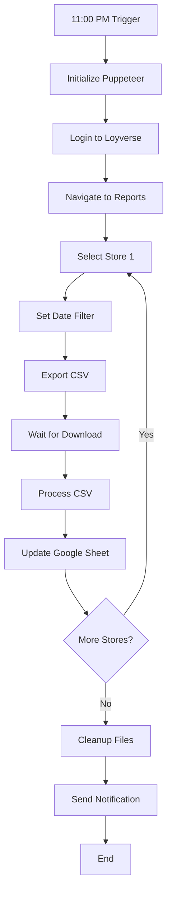

# Product Requirements Document
## Loyverse POS Daily Sales Automation System

**Document Version:** 1.0  
**Date:** January 2025  
**Project Duration:** 14 Days  
**Budget:** $225 USD (Fixed Price)  
**Client Location:** Manila, Philippines

---

## Table of Contents
1. [Executive Summary](#executive-summary)
2. [Project Overview](#project-overview)
3. [Business Requirements](#business-requirements)
4. [Technical Architecture](#technical-architecture)
5. [Functional Requirements](#functional-requirements)
6. [Non-Functional Requirements](#non-functional-requirements)
7. [System Workflow](#system-workflow)
8. [Data Specifications](#data-specifications)
9. [Security Requirements](#security-requirements)
10. [Infrastructure Requirements](#infrastructure-requirements)
11. [Integration Requirements](#integration-requirements)
12. [User Interface Requirements](#user-interface-requirements)
13. [Testing Requirements](#testing-requirements)
14. [Deployment Strategy](#deployment-strategy)
15. [Maintenance & Support](#maintenance-support)
16. [Project Timeline](#project-timeline)
17. [Success Metrics](#success-metrics)
18. [Risk Management](#risk-management)
19. [Appendices](#appendices)

---

## 1. Executive Summary {#executive-summary}

### 1.1 Purpose
This document defines the requirements for developing an automated system that extracts daily sales data from Loyverse POS system and populates Google Sheets for 5 retail store branches in Manila, Philippines.

### 1.2 Scope
The project encompasses the development of a fully automated solution using Puppeteer.js for web automation, Node.js/Express for backend processing, n8n for workflow orchestration, and Google Sheets for data storage.

### 1.3 Key Objectives
- Eliminate manual daily data entry across 5 store branches
- Ensure 99%+ automation reliability
- Provide cost-effective solution with minimal monthly expenses
- Deliver user-friendly admin controls for non-technical users
- Complete project within 14-day timeline and $225 budget

---

## 2. Project Overview {#project-overview}

### 2.1 Current State
- **Manual Process:** Staff manually extracts sales data from Loyverse POS
- **Time Investment:** Approximately 30-45 minutes daily
- **Error Rate:** Human errors in data entry
- **Scalability Issues:** Difficult to maintain consistency across 5 stores

### 2.2 Future State
- **Automated Process:** System runs daily at 11:00 PM Manila time
- **Time Savings:** Zero manual intervention required
- **Accuracy:** 100% data accuracy from CSV exports
- **Scalability:** Easily handles all 5 stores with room for expansion

### 2.3 Project Constraints
- **Budget:** $225 USD fixed price
- **Timeline:** 14 days from project start
- **Technical:** Client has limited technical expertise
- **Cost:** Minimize ongoing monthly expenses

---

## 3. Business Requirements {#business-requirements}

### 3.1 Core Business Needs
1. **Daily Sales Tracking:** Automated extraction of sales data for all items sold
2. **Multi-Store Support:** Handle 5 different store branches
3. **Data Organization:** Separate sheets per store for performance
4. **Historical Records:** Maintain daily records for monthly archiving
5. **Accessibility:** Data available in Google Sheets for easy access

### 3.2 Stakeholders
- **Primary User:** Job Gonzales (Company Admin)
- **End Users:** Store managers and accounting staff
- **Developer:** Mostafa Salehi (mostafasalehi796@gmail.com)
- **Store Branches:** 5 locations including "Apung Iska - MAT"

### 3.3 Business Value
- **Labor Cost Savings:** ~15 hours/week of manual work eliminated
- **Improved Accuracy:** Elimination of human data entry errors
- **Real-time Insights:** Daily updated sales data for decision making
- **Scalability:** Easy to add new stores without additional effort

---

## 4. Technical Architecture {#technical-architecture}

### 4.1 System Components

```
┌─────────────────┐     ┌──────────────────┐     ┌─────────────────┐
│   Loyverse POS  │────▶│  Puppeteer.js    │────▶│   CSV Files     │
│   Dashboard     │     │  Web Automation   │     │  (Downloads)    │
└─────────────────┘     └──────────────────┘     └────────┬────────┘
                                                           │
                        ┌──────────────────┐               │
                        │   n8n Workflow   │◀──────────────┤
                        │   (Self-hosted)  │               │
                        └────────┬─────────┘               │
                                 │                         │
                        ┌────────▼─────────┐     ┌────────▼────────┐
                        │  Google Sheets   │     │  Node.js API    │
                        │  (5 Store Tabs)  │◀────│  CSV Processing │
                        └──────────────────┘     └─────────────────┘
```

### 4.2 Technology Stack
- **Web Automation:** Puppeteer.js (headless Chrome)
- **Backend:** Node.js with Express.js framework
- **CSV Processing:** csv-parser library
- **Workflow Engine:** n8n (self-hosted)
- **Data Storage:** Google Sheets API v4
- **Hosting:** Google Cloud Platform (GCP)
- **Version Control:** Git repository

### 4.3 System Architecture Principles
1. **Modularity:** Separate concerns for maintenance
2. **Reliability:** Built-in retry mechanisms
3. **Scalability:** Easy to add new stores
4. **Security:** Encrypted credential storage
5. **Maintainability:** Clean code with documentation

---

## 5. Functional Requirements {#functional-requirements}

### 5.1 Authentication Management
- **FR-001:** System shall securely store Loyverse login credentials
- **FR-002:** System shall handle session management and re-authentication
- **FR-003:** Credentials must be encrypted at rest
- **FR-004:** Support for invitation-based access system

### 5.2 Data Extraction
- **FR-005:** Navigate to Loyverse Reports → Sales by Item
- **FR-006:** Set date filter to current day automatically
- **FR-007:** Iterate through all 5 store branches
- **FR-008:** Handle page refresh after store selection
- **FR-009:** Trigger CSV export for each store
- **FR-010:** Monitor and wait for download completion

### 5.3 CSV Processing
- **FR-011:** Parse downloaded CSV files
- **FR-012:** Extract: Item name, Category, Items sold, Gross sales
- **FR-013:** Add metadata: Date Sold, Store Branch
- **FR-014:** Validate data integrity
- **FR-015:** Clean up temporary files after processing

### 5.4 Data Population
- **FR-016:** Connect to Google Sheets via API
- **FR-017:** Create/update separate sheet per store
- **FR-018:** Append daily data to existing records
- **FR-019:** Maintain column order: Date Sold | Store Branch | Item name | Category | Items sold | Gross sales
- **FR-020:** Handle duplicate prevention

### 5.5 Scheduling & Automation
- **FR-021:** Execute daily at 11:00 PM Manila time
- **FR-022:** Support manual trigger via API
- **FR-023:** Queue management for sequential processing
- **FR-024:** Notification on completion/failure

### 5.6 Admin Dashboard
- **FR-025:** View automation status and history
- **FR-026:** Manual trigger capability
- **FR-027:** View error logs and diagnostics
- **FR-028:** Download automation reports
- **FR-029:** Update store list configuration

---

## 6. Non-Functional Requirements {#non-functional-requirements}

### 6.1 Performance
- **NFR-001:** Complete daily extraction within 30 minutes
- **NFR-002:** Process CSV files under 1MB in less than 5 seconds
- **NFR-003:** API response time under 2 seconds
- **NFR-004:** Support concurrent requests without degradation

### 6.2 Reliability
- **NFR-005:** 99% uptime for automation service
- **NFR-006:** Automatic retry for failed extractions (3 attempts)
- **NFR-007:** Graceful handling of Loyverse downtime
- **NFR-008:** Data consistency verification

### 6.3 Security
- **NFR-009:** HTTPS encryption for all communications
- **NFR-010:** API key authentication for n8n integration
- **NFR-011:** Principle of least privilege for Google Sheets access
- **NFR-012:** Audit logging for all operations

### 6.4 Usability
- **NFR-013:** Simple admin interface for non-technical users
- **NFR-014:** Clear error messages in plain language
- **NFR-015:** Mobile-responsive admin dashboard
- **NFR-016:** Intuitive navigation and controls

### 6.5 Scalability
- **NFR-017:** Support for up to 10 stores without code changes
- **NFR-018:** Handle CSV files up to 10MB
- **NFR-019:** Process up to 10,000 items per store
- **NFR-020:** Maintain performance with 1 year of historical data

---

## 7. System Workflow {#system-workflow}

### 7.1 Daily Automation Flow



### 7.2 Error Handling Flow
1. **Detection:** Identify failure point
2. **Logging:** Record error details
3. **Retry:** Attempt recovery (max 3 times)
4. **Escalation:** Notify admin if unrecoverable
5. **Fallback:** Queue for manual intervention

### 7.3 CSV Processing Pipeline
1. **Download Monitoring:** Watch download directory
2. **File Validation:** Verify CSV integrity
3. **Data Parsing:** Extract required fields
4. **Transformation:** Add metadata and format
5. **Upload:** Send to Google Sheets
6. **Cleanup:** Remove temporary files

---

## 8. Data Specifications {#data-specifications}

### 8.1 Input Data (Loyverse CSV)
| Field | Type | Description | Example |
|-------|------|-------------|---------|
| Item Name | String | Product name | "Coffee Latte" |
| Category | String | Product category | "Beverages" |
| Items Sold | Integer | Quantity sold | 25 |
| Gross Sales | Decimal | Total sales amount | 1250.50 |

### 8.2 Output Data (Google Sheets)
| Column | Type | Description | Example |
|--------|------|-------------|---------|
| Date Sold | Date | Transaction date | "2025-01-15" |
| Store Branch | String | Store location | "Apung Iska - MAT" |
| Item Name | String | Product name | "Coffee Latte" |
| Category | String | Product category | "Beverages" |
| Items Sold | Integer | Quantity sold | 25 |
| Gross Sales | Decimal | Total sales amount | 1250.50 |

### 8.3 Data Validation Rules
- **Date Format:** YYYY-MM-DD
- **Store Branch:** Must match predefined list
- **Items Sold:** Non-negative integer
- **Gross Sales:** Non-negative decimal with 2 places
- **Required Fields:** All fields mandatory

---

## 9. Security Requirements {#security-requirements}

### 9.1 Authentication & Authorization
- **Credential Storage:** AES-256 encryption
- **API Keys:** Environment variables
- **Access Control:** Role-based permissions
- **Session Management:** 24-hour timeout

### 9.2 Data Protection
- **In Transit:** TLS 1.2+ encryption
- **At Rest:** Encrypted storage
- **CSV Files:** Temporary with secure deletion
- **Logs:** Sanitized sensitive information

### 9.3 Audit & Compliance
- **Activity Logging:** All operations tracked
- **Access Logs:** User access recorded
- **Error Logs:** Detailed for debugging
- **Retention:** 90-day log retention

---

## 10. Infrastructure Requirements {#infrastructure-requirements}

### 10.1 Server Specifications
- **Provider:** Google Cloud Platform
- **Instance Type:** e2-micro (minimum)
- **OS:** Ubuntu 22.04 LTS
- **Storage:** 20GB SSD
- **RAM:** 2GB minimum
- **Network:** Static IP address

### 10.2 Software Requirements
- **Node.js:** v18.x or higher
- **Chrome:** Latest stable for Puppeteer
- **n8n:** Latest self-hosted version
- **PM2:** Process management
- **Nginx:** Reverse proxy

### 10.3 Monitoring & Backup
- **Uptime Monitoring:** 5-minute intervals
- **Resource Monitoring:** CPU, RAM, Disk
- **Backup Schedule:** Daily configuration backup
- **Recovery Time:** < 1 hour RTO

---

## 11. Integration Requirements {#integration-requirements}

### 11.1 Loyverse POS Integration
- **URL:** r.loyverse.com
- **Method:** Web automation (Puppeteer)
- **Authentication:** Username/password
- **Data Format:** CSV export

### 11.2 Google Sheets Integration
- **API Version:** Google Sheets API v4
- **Authentication:** Service account
- **Permissions:** Read/write to specific sheets
- **Rate Limits:** 100 requests per 100 seconds

### 11.3 n8n Integration
- **Deployment:** Self-hosted
- **Triggers:** Cron schedule and webhook
- **Nodes:** HTTP Request, Google Sheets
- **Error Handling:** Built-in retry logic

---

## 12. User Interface Requirements {#user-interface-requirements}

### 12.1 Admin Dashboard
- **Technology:** React.js or Vue.js
- **Responsive:** Mobile and desktop
- **Authentication:** Secure login
- **Real-time Updates:** WebSocket or polling

### 12.2 Dashboard Features
1. **Status Overview**
   - Current automation status
   - Last run timestamp
   - Success/failure indicators

2. **Store Management**
   - List of active stores
   - Enable/disable stores
   - Add new store configuration

3. **Logs & Reports**
   - Execution history
   - Error logs with details
   - Export functionality

4. **Manual Controls**
   - Trigger immediate run
   - Stop running process
   - Download backup data

---

## 13. Testing Requirements {#testing-requirements}

### 13.1 Unit Testing
- **Coverage:** Minimum 80%
- **Framework:** Jest or Mocha
- **Focus Areas:** CSV parsing, data transformation

### 13.2 Integration Testing
- **Puppeteer Scripts:** All navigation paths
- **API Endpoints:** All routes and methods
- **Google Sheets:** CRUD operations

### 13.3 End-to-End Testing
- **Full Workflow:** Complete automation cycle
- **Error Scenarios:** Network failures, login errors
- **Performance:** Load testing with large CSV files

### 13.4 User Acceptance Testing
- **Duration:** 2 days with client
- **Scenarios:** Daily operations, error recovery
- **Sign-off:** Client approval required

---

## 14. Deployment Strategy {#deployment-strategy}

### 14.1 Deployment Phases
1. **Development Environment:** Local testing
2. **Staging Environment:** GCP test instance
3. **Production Environment:** GCP production instance

### 14.2 Deployment Checklist
- [ ] Code review completed
- [ ] All tests passing
- [ ] Environment variables configured
- [ ] SSL certificates installed
- [ ] Monitoring alerts configured
- [ ] Backup procedures tested
- [ ] Documentation updated
- [ ] Client training completed

### 14.3 Rollback Plan
- **Strategy:** Blue-green deployment
- **Rollback Time:** < 5 minutes
- **Data Preservation:** No data loss during rollback

---

## 15. Maintenance & Support {#maintenance-support}

### 15.1 Warranty Period
- **Duration:** 30 days post-deployment
- **Coverage:** Bug fixes and critical issues
- **Response Time:** Within 24 hours
- **Resolution Time:** Within 48 hours

### 15.2 Documentation Deliverables
1. **Technical Documentation**
   - System architecture
   - API documentation
   - Database schema
   - Deployment guide

2. **User Documentation**
   - Admin user guide
   - Troubleshooting guide
   - FAQ section

3. **Operational Documentation**
   - Monitoring setup
   - Backup procedures
   - Disaster recovery

### 15.3 Knowledge Transfer
- **Training Session:** 2-hour virtual session
- **Video Tutorials:** Key operations recorded
- **Support Channel:** Email support during warranty

---

## 16. Project Timeline {#project-timeline}

### 16.1 Week 1 (Days 1-7)

| Day | Tasks | Deliverables |
|-----|-------|--------------|
| 1-2 | Puppeteer implementation | Working automation script |
| 3-4 | Backend API development | REST API with endpoints |
| 5-6 | n8n workflow setup | Configured workflows |
| 7 | Integration testing | Test results report |

### 16.2 Week 2 (Days 8-14)

| Day | Tasks | Deliverables |
|-----|-------|--------------|
| 8-9 | GCP deployment | Live staging environment |
| 10-11 | End-to-end testing | UAT scenarios completed |
| 12-13 | Security & admin UI | Secure production system |
| 14 | Documentation & handover | Complete project package |

### 16.3 Milestones
- **Milestone 1:** Development complete (Day 7) - 50% payment
- **Milestone 2:** Production deployment (Day 14) - 50% payment

---

## 17. Success Metrics {#success-metrics}

### 17.1 Technical Metrics
- **Automation Success Rate:** ≥ 99%
- **Processing Time:** < 30 minutes for all stores
- **Data Accuracy:** 100% match with source
- **System Uptime:** ≥ 99%

### 17.2 Business Metrics
- **Time Saved:** 15+ hours per week
- **Error Reduction:** 100% elimination of manual errors
- **Cost Savings:** ROI within 1 month
- **User Satisfaction:** Positive feedback from admin

### 17.3 Acceptance Criteria
1. ✓ Automated daily execution without intervention
2. ✓ All 5 stores data extracted successfully
3. ✓ Google Sheets updated with correct format
4. ✓ Admin dashboard fully functional
5. ✓ Documentation complete and approved
6. ✓ 3 consecutive days of successful operation

---

## 18. Risk Management {#risk-management}

### 18.1 Technical Risks

| Risk | Probability | Impact | Mitigation |
|------|-------------|--------|------------|
| Loyverse UI changes | Medium | High | Use stable selectors, monitor changes |
| API rate limits | Low | Medium | Implement throttling and queuing |
| Server downtime | Low | High | Auto-restart, monitoring alerts |
| Data corruption | Low | High | Validation checks, backups |

### 18.2 Business Risks

| Risk | Probability | Impact | Mitigation |
|------|-------------|--------|------------|
| Scope creep | Medium | Medium | Clear requirements, change control |
| Timeline delay | Low | Medium | Daily progress tracking |
| User adoption | Low | Low | Comprehensive training |

### 18.3 Contingency Plans
- **Loyverse Changes:** Rapid update capability (< 24 hours)
- **System Failure:** Manual extraction procedure documented
- **Data Loss:** Daily backups with 7-day retention

---

## 19. Appendices {#appendices}

### Appendix A: Store Branch List
1. Apung Iska - MAT
2. [Store 2 Name - TBD]
3. [Store 3 Name - TBD]
4. [Store 4 Name - TBD]
5. [Store 5 Name - TBD]

### Appendix B: API Endpoints

| Endpoint | Method | Description |
|----------|--------|-------------|
| `/api/extract-daily-sales` | POST | Trigger manual extraction |
| `/api/health` | GET | System health check |
| `/api/logs` | GET | Retrieve system logs |
| `/api/stores` | GET | List configured stores |
| `/api/download-status` | GET | Check download progress |

### Appendix C: Error Codes

| Code | Description | Resolution |
|------|-------------|------------|
| E001 | Login failed | Check credentials |
| E002 | Store not found | Verify store name |
| E003 | Download timeout | Retry extraction |
| E004 | CSV parse error | Check file format |
| E005 | Sheets API error | Verify permissions |

### Appendix D: Environment Variables

```env
# Loyverse Credentials
LOYVERSE_USERNAME=
LOYVERSE_PASSWORD=

# Google Sheets
GOOGLE_SERVICE_ACCOUNT_KEY=
GOOGLE_SPREADSHEET_ID=

# API Configuration
API_PORT=3000
API_KEY=

# n8n Configuration
N8N_WEBHOOK_URL=

# System Settings
TIMEZONE=Asia/Manila
DOWNLOAD_TIMEOUT=30000
MAX_RETRIES=3
```

### Appendix E: Sample CSV Structure

```csv
"Item Name","Category","Items Sold","Gross Sales"
"Coffee Latte","Beverages",25,1250.50
"Chocolate Cake","Desserts",10,800.00
"Sandwich","Food",15,1125.75
```

---

## Document Control

| Version | Date | Author | Changes |
|---------|------|--------|---------|
| 1.0 | Jan 2025 | Development Team | Initial PRD |

---

## Approval Sign-offs

| Role | Name | Signature | Date |
|------|------|-----------|------|
| Client | Job Gonzales | _________ | _____ |
| Developer | Mostafa Salehi | _________ | _____ |

---

**End of Document**